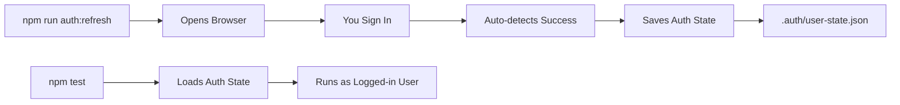

# BizBuddy E2E Tests - Developer Guide

## 🚀 Quick Start

### First Time Setup
```bash
# Clone the repository
git clone https://github.com/gianmatteo-arcana/biz-buddy-e2e-tests.git
cd biz-buddy-e2e-tests

# Install dependencies
npm install

# Capture your auth state (opens browser)
npm run auth:refresh

# Run a test to verify everything works
npm test
```

## 📋 Table of Contents

1. [Understanding the Tests](#understanding-the-tests)
2. [Authentication Management](#authentication-management)
3. [Running Tests](#running-tests)
4. [Writing New Tests](#writing-new-tests)
5. [Troubleshooting](#troubleshooting)
6. [CI/CD Setup](#cicd-setup)

## Understanding the Tests

### Test Categories

#### 1. **Authenticated Tests** (use saved auth state)
- `full-auth-flow.spec.ts` - Comprehensive test of authenticated dashboard
- `test-simple.spec.ts` - Basic auth verification (has timing issues)
- `test-debug.spec.ts` - Detailed logging for debugging

#### 2. **Fresh Signup Tests** (no saved auth)
- `manual-signup-test.spec.ts` - Interactive OAuth flow (recommended)
- `google-oauth-flow.spec.ts` - Automated OAuth (requires credentials)
- `fresh-signup-flow.spec.ts` - Template for signup testing

### How It Works



## Authentication Management

### Capturing Authentication

```bash
# Capture new auth state
npm run auth:refresh
```

**What happens:**
1. Opens Chrome browser
2. Navigates to BizBuddy
3. Waits for you to sign in with Google
4. **Automatically detects** when you're authenticated
5. Saves cookies + localStorage to `.auth/user-state.json`

### Checking Auth Status

```bash
# Check if auth is still valid
npm run auth:check
```

**Example output:**
```json
{
  "valid": true,
  "expiresAt": "1/15/2025, 3:30:00 PM",
  "minutesLeft": 45,
  "timeLeft": 2700000
}
```

### When to Refresh Auth

- Token expires after ~1 hour
- Refresh when `minutesLeft` < 10
- After seeing authentication errors in tests

## Running Tests

### Authenticated Tests

```bash
# Run all tests (uses saved auth)
npm test

# Run specific test
npx playwright test tests/e2e/full-auth-flow.spec.ts

# Run with UI mode (great for debugging)
npm run test:ui

# Run with headed browser (see what's happening)
npm run test:headed
```

### Fresh Signup Tests

```bash
# Manual signup (recommended) - opens browser for you to sign in
npm run test:manual-signup

# Automated OAuth (requires credentials)
export TEST_GOOGLE_EMAIL="your-test@gmail.com"
export TEST_GOOGLE_PASSWORD="your-password"
npm run test:oauth-flow

# Basic signup flow test
npm run test:fresh-signup
```

### Test Output

Tests create screenshots in `test-results/`:
- `full-flow-2-authenticated.png` - Dashboard after auth
- `manual-signup-success.png` - Successful signup
- `test-failed-1.png` - Failure screenshots

## Writing New Tests

### Basic Authenticated Test

```typescript
import { test, expect } from '@playwright/test';

test('my authenticated test', async ({ page }) => {
  // Navigate to app (auth state is automatically loaded)
  await page.goto('https://your-app.lovableproject.com');
  
  // Wait for dashboard
  await page.waitForTimeout(3000);
  
  // Your test logic here
  await expect(page.locator('text=Dashboard')).toBeVisible();
});
```

### Test Without Auth

```typescript
import { test, expect } from '@playwright/test';

// Start fresh - no auth
test.use({ storageState: { cookies: [], origins: [] } });

test('fresh user flow', async ({ page }) => {
  await page.goto('https://your-app.lovableproject.com');
  
  // Should see login page
  await expect(page.locator('text=Sign in')).toBeVisible();
});
```

### Best Practices

1. **Wait for elements** properly:
```typescript
// Good
await page.locator('text=Welcome').waitFor({ state: 'visible' });

// Better - with timeout
await expect(page.locator('text=Welcome')).toBeVisible({ timeout: 15000 });
```

2. **Handle timing issues**:
```typescript
// Wait for auth to process
await page.waitForTimeout(3000);

// Or wait for specific element
await page.waitForSelector('text=Dashboard', { timeout: 30000 });
```

3. **Take screenshots** on important steps:
```typescript
await page.screenshot({ path: 'test-results/my-test.png' });
```

## Troubleshooting

### Common Issues

#### "Sign in button not found"
- The app might already be authenticated
- Clear auth: `rm -rf .auth/`
- Run test again

#### "Loading spinner forever"
- Auth token might be expired
- Run: `npm run auth:check`
- If expired: `npm run auth:refresh`

#### "Test times out"
- Increase timeout in test:
```typescript
test.setTimeout(60000); // 1 minute
```

#### "OAuth automation fails"
- Google might show captcha/2FA
- Use manual test instead: `npm run test:manual-signup`

### Debug Mode

```bash
# Run with debug logging
npx playwright test tests/e2e/test-debug.spec.ts

# Run with Playwright Inspector
npx playwright test --debug

# See browser console logs
page.on('console', msg => console.log('Browser:', msg.text()));
```

## CI/CD Setup

### Railway Deployment (Future)

1. **Encode auth state**:
```bash
npm run auth:encode
```

2. **Set in Railway**:
- Add `BIZBUDDY_AUTH_STATE` environment variable
- Paste the base64 string

3. **Deploy**:
```bash
railway up
```

### GitHub Actions (Future)

```yaml
- name: Prepare auth
  run: npm run ci:prepare
  env:
    BIZBUDDY_AUTH_STATE: ${{ secrets.BIZBUDDY_AUTH_STATE }}

- name: Run tests
  run: npm test
```

## File Structure

```
├── .auth/
│   └── user-state.json      # Saved auth (gitignored)
├── tests/
│   ├── auth/                # Auth setup tests
│   └── e2e/                 # Main test files
├── test-results/            # Screenshots & videos
├── auth-manager.js          # Auth capture logic
├── playwright.config.ts     # Main config (with auth)
└── playwright.config.no-auth.ts  # Config for fresh tests
```

## Tips & Tricks

### 1. Speed up tests
```typescript
// Skip animations
await page.addInitScript(() => {
  window.matchMedia = () => ({
    matches: false,
    addListener: () => {},
    removeListener: () => {},
  });
});
```

### 2. Better selectors
```typescript
// Use data-testid when possible
await page.locator('[data-testid="submit-button"]').click();

// Text selectors for user-visible content
await page.locator('text=Welcome back').click();

// Combine for precision
await page.locator('button:has-text("Submit")').click();
```

### 3. Handle popups
```typescript
// Listen for new pages (popups)
const [popup] = await Promise.all([
  page.waitForEvent('popup'),
  page.locator('text=Open popup').click(),
]);
```

### 4. Network waiting
```typescript
// Wait for API calls to complete
await page.waitForLoadState('networkidle');

// Or wait for specific request
await page.waitForResponse(resp => 
  resp.url().includes('/api/user') && resp.status() === 200
);
```

## Need Help?

- Check test output in `test-results/`
- Run with `--debug` flag
- Use `test:manual-signup` for OAuth issues
- File issues at: https://github.com/gianmatteo-arcana/biz-buddy-e2e-tests/issues